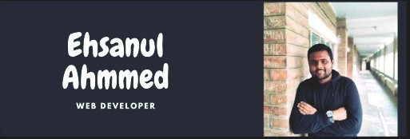

### Hi there 👋, my name is Ehsanul Ahmmed
#### Web developer

I am Ehsanul Ahmmed. I am an undergraduate student of AIUB. I am an enthusiastic software developer specialized in Web application. I have skills in web designing. I have some experiences in Back-end development too. Again, I have gained some skills in graphics design also. I am some experiences in Python too

Skills: HTML / CSS/ JavaScript/ReactJs/ PHP/Python

- 🔭 I’m currently working on Web Developing 
- 🌱 I’m currently learning JavaScript, PHP, ReactJS 
- 👯 I’m looking to collaborate on Github 

  # https://github.com/ehsan-0801

          

